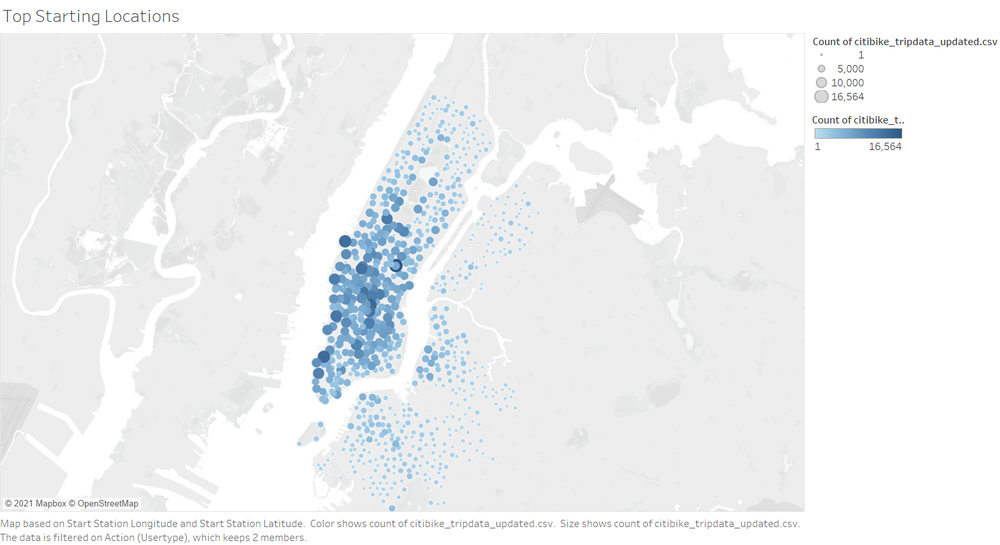
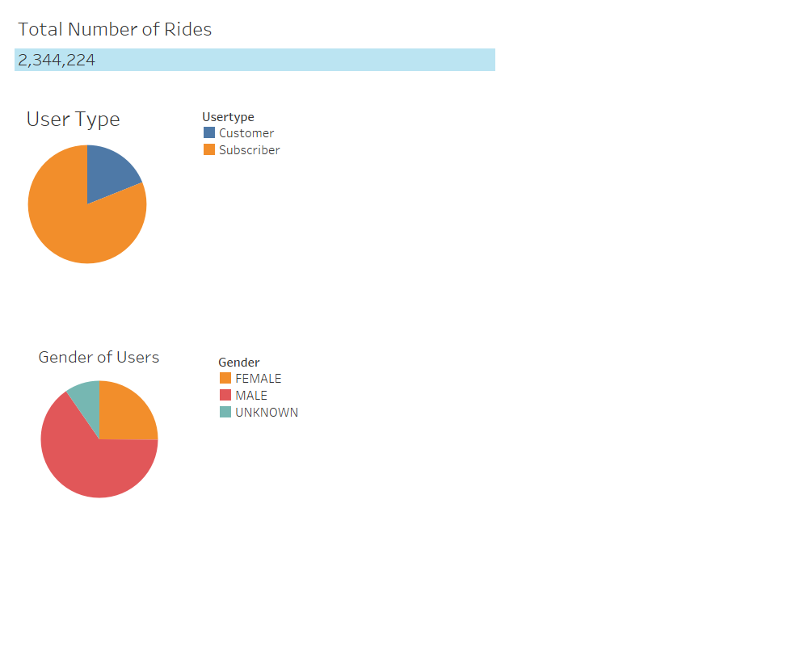
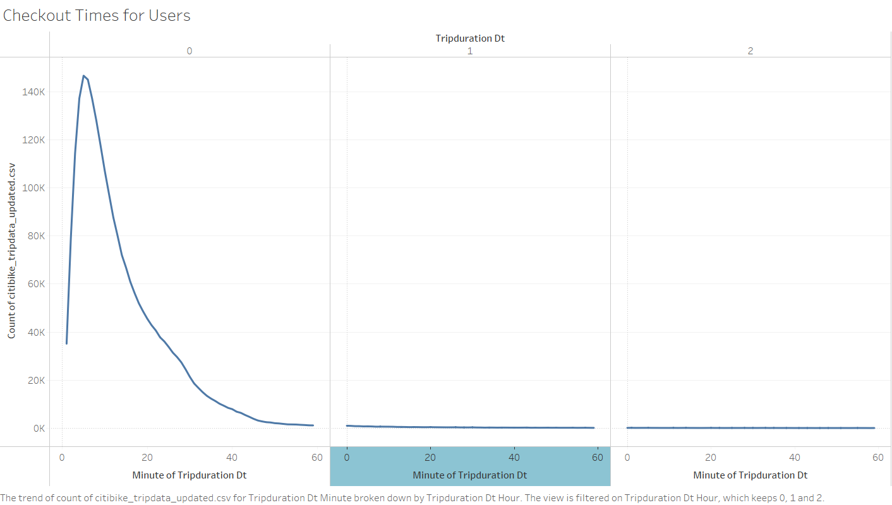
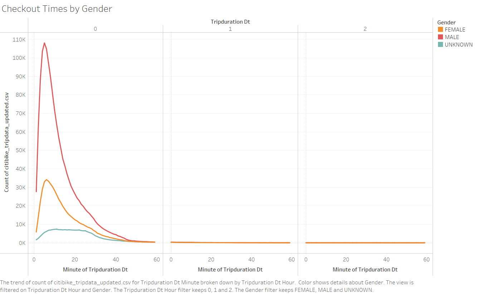
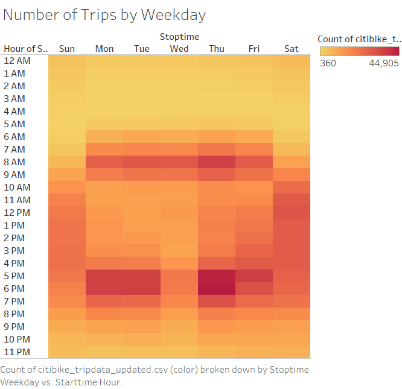
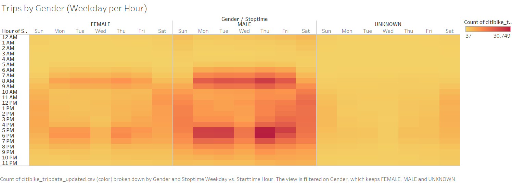
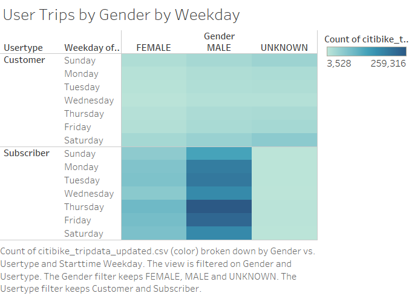

# bikesharing

## Overview

The purpose of this project is to explore ridership trends for New York City's Citibike bike sharing service. Ridership data for August, 2019 is explored using Tableau. A Tableau Story containing results can be found at the following link: [NYC Bike Citibike](https://public.tableau.com/app/profile/jason.hilberdink/viz/NYC_Citibike_16224818248980/Story1).

## Results

##### Top Starting Locations for Trips

The map above shows the most popular starting locations for Citibike trips. The most heavily used stations are located in Manhattan, likely a result of the area's population density and volume of tourists. 

##### Citibike Users

There were over 2 million Citibike rides in August 2019. The majority of trips were taken by subscribers, rather than short-term customers. Male riders used the service more heavily than other genders.

##### Checkout Times

The graph above shows the length of time riders checked out bikes. Most rides were short, with a high number taking less than twenty minutes. 

##### Checkout Times by Gender

This graph compares the checkout times of riders by gender. The higher number of male riders is driven almost entirely by short trips. Checkout times for all riders converge for trips greater than 40 minutes.

##### Number of Trips by Weekday

The above heatmap shows the number of trips taken by weekday and hour. Peak ridership hours took place in the morning and evening hours on weekdays. Weekends had lower peak totals than weekdays, but more consistent usage throughout the day.

##### Number of Trips by Weekday by Gender

This further breaks down the times of rides by gender. Peak hours were similar across genders, with male riders using the service the most heavily. 

##### User trips by Gender and Weekday

Finally, this heatmap shows the number of rides by user type and gender for each day of the week. Subscribers took more rides than short-term customers, and male riders took more rides than other genders. Weekdays tended to be busier than weekends, with Thursday and Friday being particularly busy.

## Summary

An exploration of the Citibike ridership data for August, 2019 led to the following conclusions:

- A majority of rides were taken by subscribers rather than short-term customers.
- Male riders took more rides than other genders.
- Most rides were short in duration, with bikes checked out for less than twenty minutes.
- Peak ridership hours occurred on weekday mornings and evenings.

Further analysis might look further at bike checkout times, possibly creating visualizations of bike checkout time by user type, and checkout times for days of the week.

#### 
